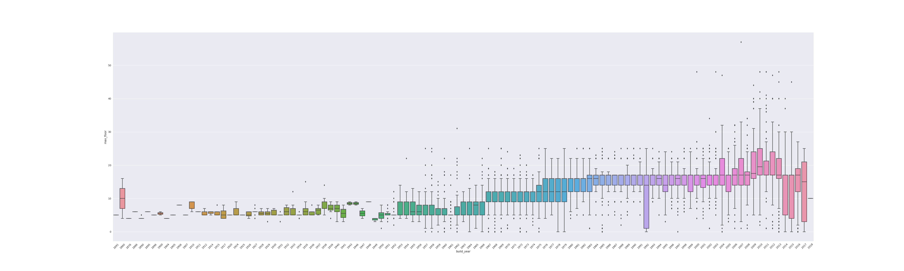
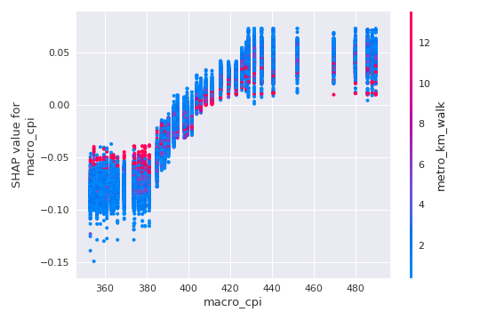

## SHAP experiments

Experiments with SHAP package on [Sberbank](https://www.kaggle.com/c/sberbank-russian-housing-market) Kaggle Competetion.

Competition link: [https://www.kaggle.com/c/sberbank-russian-housing-market](https://www.kaggle.com/c/sberbank-russian-housing-market)

### Visualizations

**Data Preprocessing:**

- Price (Pic. 1) is converted to Log Price (Pic. 2)
- Filling missing values
    - `build_year` is filled with mode by `sub_area` (Pic. 3)
    - `max_floor` is filled with mode by `build_year` (Pic. 4)
    - `kitchen_sq` and `life_sq` (Pic. 5 and Pic. 6)
        - NaNs and anomalies are replaced with regression on `full_sq`

| Picture 1                                         | Picture 2
| :-----------------------------------------------: | :--------------------------------------------------: |
|  |  |

| Picture 3                                         |
| :-----------------------------------------------: |
|  |

| Picture 4                                         |
| :-----------------------------------------------: |
|  |

| Picture 5                                         | Picture 6
| :-----------------------------------------------: | :--------------------------------------------------: |
|  |  |

**SHAP results:**

- Summary Plot

- Example of Force Plot (observation 3)

- Example of Force Plot (observation 3)
    - `full_sq`
    - `build_year`
    - `macro_cpi`

